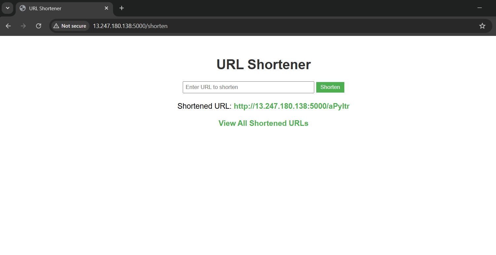

# URL Shortener with Analytics

A simple web application to shorten URLs and track click analytics, built with Flask, Redis, RQ, and Docker Compose.

## Purpose
This project was created to practice **Docker Compose** by orchestrating a multi-container application. It combines Flask for the web interface, Redis for data storage and job queuing, and RQ for background click tracking—perfect for anyone learning containerization and microservices.

## Features
- **Shorten URLs**: Generate a unique 6-character short code for any URL.
- **View All Shortened URLs**: Display a list of all shortened URLs and their original links.
- **Click Analytics**: Track the number of clicks on each shortened URL, processed in the background.
- **Persistent Data**: Retain URL mappings and click counts across container restarts using a Docker volume.

## Architecture
The app runs three services in Docker containers:
- **Flask Web App**: Manages URL shortening, redirection, and job queuing.
- **Redis**: Stores URL mappings and click counts, and serves as the RQ job queue.
- **RQ Worker**: Processes background jobs to update click analytics.

These services are orchestrated using Docker Compose, with Redis data persisted via a named volume (`redis-data`).

## Prerequisites
To run this project, you’ll need:
- **Docker**: [Install Docker](https://docs.docker.com/get-docker/)
- **Docker Compose**: [Install Docker Compose](https://docs.docker.com/compose/install/)

## Setup and Running the App
Follow these steps to get the app up and running:

1. **Clone the Repository**:
   ```bash
   git clone https://github.com/yourusername/url-shortener.git
   cd url-shortener

2. **Build and Start the Containers**:
   ```bash
   docker compose up --build
   ```
   - This command builds the Flask and RQ worker images and launches all services.
   - The app will be available at `http://<your-ip-address>:5000`.

3. **Stop the Containers**:
   ```bash
   docker compose down
   ```
   - Stops and removes the containers while preserving Redis data in the volume.

## Using the App
Once the app is running, here’s how to use it:

1. **Shorten a URL**:
   - Go to `http://<your-ip-address>:5000`.
   - Enter a URL (e.g., `https://example.com`) and click "Shorten".
   - Get a shortened URL like `http://<your-ip-address>:5000/Xy7Kp9`.

2. **View All Shortened URLs**:
   - Click "View All Shortened URLs" or visit `http://<your-ip-address>:5000/list`.
   - See a list of all shortened URLs and their original destinations.

3. **Click a Shortened URL**:
   - Visit a shortened URL (e.g., `http://<your-ip-address>:5000/Xy7Kp9`).
   - It redirects to the original URL, and the click count updates in the background.

## UI Snapshots
- **Homepage**: See how the URL shortening form looks:  
  
- **List Page**: View the list of all shortened URLs:  
     

## Data Persistence
- Redis data (URL mappings and click counts) is stored in the `redis-data` volume.
- This ensures data persists even if you stop or restart the containers.

## Project Structure
Here’s an overview of the key files:
```
url_shortener/
├── web/
│   ├── app.py              # Flask application
│   ├── templates/
│   │   ├── index.html      # Homepage template
│   │   └── list.html       # URL list template
│   └── static/
│       └── style.css       # Basic CSS styling
├── jobs/
│   └── analytics.py        # RQ job for click tracking
├── Dockerfile              # Docker image configuration
├── docker compose.yml      # Docker Compose setup
└── requirements.txt        # Python dependencies
```

---

If you found this project helpful, please give it a ⭐ to support the repository!
```
